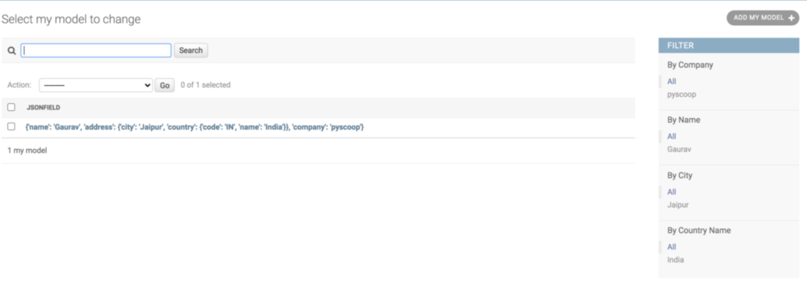

Django provides a JSONField which is useful to store JSON data and query on it. However, this is supported by PostgreSQL only. If you want to use JSONField with MySQL or MariaDB, you can use [django-mysql-json-field](https://django-mysql.readthedocs.io/en/latest/model_fields/json_field.html). But in this post, we'll be using inbuilt JSONField.

Django provides us with a way to query on JSONfield but you can't directly use JSONField's attributes on admin as filters. In this post, I'll be creating a Filter class for JSONField that can be used to create filters on the admin page.

Let's start with a simple model that has 1 JSONField.

```python
class MyModel(models.Model):
    jsonfield = JSONField()
    # few more fields...
```

Populate this field with below data, we'll use this data throughout the post as a reference.

```json
{
    "name": "Gaurav",
    "company": "gauravvjn",
    "address": {
        "city": "Jaipur",
        "country": {"name": "India", "code": "IN"}
    }
}
```

Now suppose you want to create filters for JSONField properties/keys, for e.g. consider the above data, we want to show filters for company and city, something like below-

```python
class MyModelAdmin(admin.ModelAdmin):
    list_filter = ["jsonfield__company", "jsonfield__address__city"]
```

But as expected, this will raise an error, we can't use JSON field attributes for filtering like this. To support that we need to extend the inbuilt filter class.

```python
class JSONFieldFilter(SimpleListFilter):
    """
    Base JSONFilter class to use by individual attribute filter classes.
    """

    model_json_field_name = None  # name of the json field column in the model
    json_data_property_name = None  # name of one attribute from json data

    def lookups(self, request, model_admin):
        """
        Returns a list of tuples.
        The 1st element in each tuple is the coded value for the option that 
        will appear in the URL query.
        The 2nd element is the human-readable name for the option that will appear 
        in the right sidebar.
        """
        field_value_set = set()
        model = model_admin.model

        for json_field_data in model.objects.values_list(self.model_json_field_name, flat=True):
            field_value_set.add(self.get_child_value_from_json_field_data(json_field_data))

        return [(v, v) for v in field_value_set]

    def queryset(self, request, queryset):
        """
        Returns the filtered queryset based on the value provided in 
        the query string & retrievable via `self.value()`
        """
        if self.value():
            json_field_query = {f'{self.model_json_field_name}__{self.json_data_property_name}': self.value()}
            return queryset.filter(**json_field_query)
        else:
            return queryset
```

We are overriding two methods here, **lookups** and **queryset**.  
Method **lookups** will give us a list of tuples that will be used in filtering.  
Method **queryset** will return the filtered queryset based on the chosen filter.

Now we can extend this class to create custom admin filter classes for individual JSON field properties.

```python
class CompanyFilter(JSONFieldFilter):
    model_json_field_name = 'jsonfield'  # Name of the column in the model
    json_data_property_name = 'company' # property/field name in json data
    title = 'Company'  # A label for this filter for admin sidebar
    parameter_name = 'js_company'  # Parameter for the filter that will be used in the URL query
```

All 4 properties are mandatory. We created the first 2 properties(model\_json\_field\_name, json\_data\_property\_name) which are required by the base JSONFieldFilter class and the last 2 properties(title, parameter\_name) are managed by Django itself. You can read about it [here](https://docs.djangoproject.com/en/3.0/ref/contrib/admin/).

First 3 properties are self-explanatory, last property **parameter\_name** will be used in URL query parameter  
e.g. **/admin/myapp/mymodel/?js\_company=gauravvjn**. Here I called it **js\_company**, but the value could be anything, e.g **json\_company** but it should be unique and shouldn't conflict with other column names.

And then finally append this class to **list\_filter** list.

```python
class MyModelAdmin(admin.ModelAdmin):
    list_filter = [CompanyFilter]
```

Now visit the admin page and you should be able to see filters for the company in the sidebar.  
Let's add a filter for the **name** as well.

```python
class NameFilter(JSONFieldFilter):
    model_json_field_name = 'jsonfield'  # Name of the column in the model
    json_data_property_name = 'name' # property/field name in json data
    title = 'Name'  # A label for this filter for admin sidebar
    parameter_name = 'js_name'  # Parameter for the filter that will be used in the URL query
```

```python
class MyModelAdmin(admin.ModelAdmin):
    list_filter = [CompanyFilter, NameFilter]
```

Visit the admin page and you should be able to see filters for the company and name both in the sidebar.

Great! It's working as expected.

This works for only root level properties, So what If you want to add a filter for **address\_\_city**?

```python
class CityFilter(JSONFieldFilter):
    model_json_field_name = 'jsonfield'
    json_data_property_name = 'address__city'  # This is how you can query the DB on JSONField properties
    title = 'City'
    parameter_name = 'js_addr_city'
```

If you append **CityFilter** to **list\_filter**, it won't work and you will see an error. For that, you have to modify the **lookups** method in the base class and add support for child property (in this case country is a child of address property).

```python
def lookups(self, request, model_admin):
    if '__' in self.json_field_property_name:  # Support for child property
        keys = self.json_field_property_name.split('__')
        field_value_set = set(
            data[keys[0]][keys[1]] for data in 
            model_admin.model.objects.values_list(self.model_json_field_name, flat=True)
        )
    else:
        field_value_set = set(
            data[self.json_field_property_name] for data in 
            model_admin.model.objects.values_list(self.model_json_field_name, flat=True)
        )

    return [(v, v) for v in field_value_set]
```

We are checking here if we have double underscore in the **json\_field\_property\_name**, if yes, that means its a child property query. We split it and get the value of the child property by looking in the data. Now if you add **CityFilter** to model admin class, you should be able to see the country filter on the admin page.

```python
class MyModelAdmin(admin.ModelAdmin):
    list_filter = [CompanyFilter, NameFilter, CityFilter]
```

Now suppose you want to add a filter for a child of a child(3 level nesting), how would you do that? You can have another **if** **condition** that checks the count of double\_underscore and based on that determine whether it's a child or child of a child.

```python
if json_field_property_name.count('__') == 2:...
```

But again, that's very tedious and ugly, we can do better. We need to generalize this so no matter how many nesting we want we should be able to create a filter for that easily. For that, we'd create a helper method that will give us the final value from the data based on the **json\_field\_property\_name** value. Add below method to the JSONFieldFilter class

```python
def get_child_value_from_json_field_data(self, json_field_data):
    key_list = self.json_data_property_name.split('__')
    for key in key_list:
        if isinstance(json_field_data, dict):
            json_field_data = json_field_data[key]
    return json_field_data  
```

And call this method inside **lookups** method.

```python
def lookups(self, request, model_admin):
    field_value_set = set()

    for json_field_data in model_admin.model.objects.values_list(self.model_json_field_name, flat=True):
        field_value_set.add(self.get_child_value_from_json_field_data(json_field_data))

    return [(v, v) for v in field_value_set]
```

That's better! Now we can create filters for any child at any nested level. Let's try to create filter for the country name.

```python
class CountryFilter(JSONFieldFilter):
    model_json_field_name = 'jsonfield'
    json_data_property_name = 'address__country__name'
    title = 'Country Name'
    parameter_name = 'js_addr_country_name'


class MyModelAdmin(admin.ModelAdmin):
    list_filter = [CompanyFilter, NameFilter, CityFilter, CountryFilter]
```

Open up the admin page and you should be able to see all 4 filters in the sidebar.



## Improvements

Although this is quite useful in most of the cases but there are few things that we can improve.

1. Create a factory that generates and return the filter classes for all child automatically instead of manually creating all filter classes.
2. Have a default value for some of the parameters in case developer doesn't provide them, for e.g. if the developer doesn't provide **parameter\_name**, filter class generates a default value based on the available information. **parameter\_name = f'js\_{json\_data\_property\_name}'**.

I'll leave those for readers to exercise. _I've also Create a [Github gist](https://gist.github.com/gauravvjn/b264562ba66067f85da7a55063cbfa64) for the the final version._
