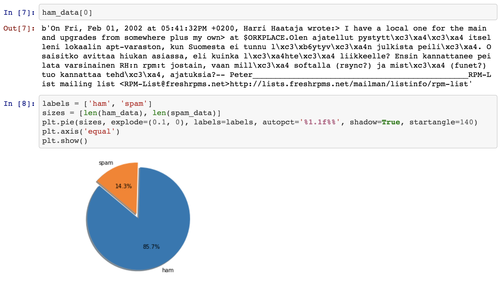
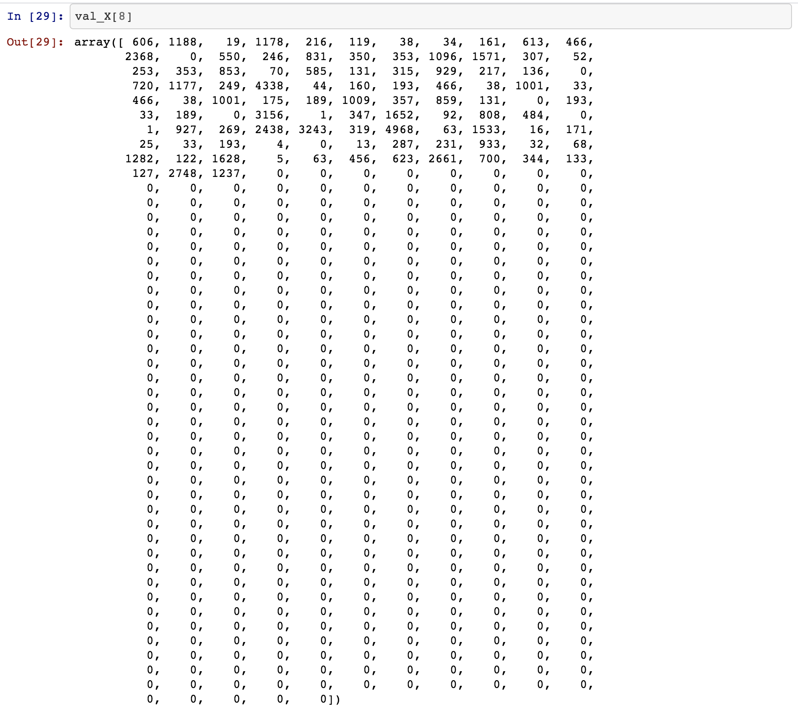

#### _Note: This is [the 2nd part of my previous post](/machine-learning-for-beginners-with-amazon-sagemaker/)._

In the previous post we learned the basics of Machine Learning and how can we leverage the AWS SageMaker to train and deploy Machine Learning models.

In this post, we are going to use the [Apache dataset for emails](https://spamassassin.apache.org/old/publiccorpus/) to classify them into two groups, spam and genuine emails. To keep this tutorial simple, we’ll consider **20030228\_easy\_ham.tar.bz2** and **20030228\_spam.tar.bz2** collections. They contain genuine and spam emails respectively. Each email is stored in a raw format in a separate file.

The First thing We need to do is initiate a new instance of the Jupyter Notebook as we’ll be writing all the code in the Notebook itself. To do this, click on Notebook instances from the left panel as you can see in the below image.


Go through all the settings and options and launch the Notebook. For this tutorial, all the default configuration would be sufficient.

If you face any issue or having trouble with SageMaker, you can follow the official document on [how to setup a Notebook instance](https://docs.aws.amazon.com/sagemaker/latest/dg/gs-setup-working-env.html).

Alright! Time to write some code now.

#### 1\. Data Processing & Preparing

If you have already gone through the [first part of this post](/machine-learning-for-beginners-with-amazon-sagemaker/), you’d be able to recall the first step that is, Data Processing & Preparing. So in this step, we are going to explore the data and convert the data into the desired format.

First, we need to download the data. Go ahead and execute below 3 lines in the Notebook. These lines will download the data and save it into a newly created directory called data.

```python
 %mkdir data  # create a data folder inside current directory
 !wget -O data/ham.tar.bz2 https://spamassassin.apache.org/old/publiccorpus/20030228_easy_ham.tar.bz2
 !wget -O data/spam.tar.bz2 https://spamassassin.apache.org/old/publiccorpus/20030228_spam.tar.bz2
```

Then we’ll extract the downloaded tar.bz2 files.

```python
 !tar xjvf data/ham.tar.bz2 -C data
 !tar xjvf data/spam.tar.bz2 -C data
```

Two new folders `easy_ham` & `spam` will be created. Each folder will contain email files.

We can see each email is stored in a separate file. so we need to iterate over each file, extract the text and store in a list/array.

An important thing to note here is that these emails have different `content_type` header such as `text/plain`, `text/html`, etc. So we also need to convert non-text/plain type emails to text/plain so that all the emails are in a common format.

```python
from bs4 import BeautifulSoup

def def convert_html_to_plain_email(email):
    """
    There are few emails which are in HTML format so we need to parse the HTML 
    and get the releavant content/message.
    """
    try:
        soup = BeautifulSoup(email, 'html.parser')
        return soup.text.replace('\n', '').encode('utf-8')
    except:
        return ''
```

```python
import os
import email
import email.policy

def get_parsed_email(data_dir):
    """
    A simple utility function that will hep us to get the parsed email data from the original dataset.
    """
    data = []

    for filename in os.listdir(data_dir):

        with open(os.path.join(data_dir, filename), 'rb') as f:
            email_obj = email.parser.BytesParser(policy=email.policy.default).parse(f)

        content_type = email_obj.get_content_type()

        if content_type == 'text/plain':
            data.append(email_obj.get_payload().replace('\n', '').encode('utf-8'))
        elif content_type == 'text/html':
            data.append(convert_html_to_plain_email(email_obj.get_payload()))
        else:
            continue

    return data
```

In the above function, you can see we are considering only `text/plain` & `text/html` content\_type, ignoring all other emails, just to keep it simple. Next, we’ll call this function for both spam and ham emails.

```python
 ham_data = get_parsed_email('data/easy_ham')
 spam_data = get_parsed_email('data/spam')
```

It’s always a good idea to take pause during data cleaning & preparation step and try to visualize the data. Let’s see how our data looks like at this point.



As we can see from the above image, after filtering out other content types, we have approx 85% ham and ~15% spam emails in our dataset. Let’s divide these datasets into training, validation and testing datasets.

To divide the data, we’ll use [scikit’s](https://scikit-learn.org/) inbuilt helper function `train_test_split`.

We need to typecast both dataset with NumPy Array(`np.array`) as the `train_test_split` will accept that datatype.

```python
import numpy as np
X = np.array(ham_data + spam_data)
```

we also need to create another NumPy Array of 0 and 1. That is an array of labels. 0 represent the ham email and 1 represent the spam email.

```python
y = np.array([0] * len(ham_data) + [1] * len(spam_data))
```

Once we typecast both lists, we’ll call `train_test_split` and split into a ratio of 70-30. 70% training data and 30% testing data. There is no standard rule for this ratio. This can vary based on the problem in hand and available dataset.

```python
from sklearn.model_selection import train_test_split
 
train_X, test_X, train_y, test_y = train_test_split(X, y, test_size=0.3)

# split the training set further into training and validation set
train_X, val_X, train_y, val_y = train_test_split(train_X, train_y, test_size=0.3)
```

Now convert these emails into words(tokenize).

```python
import re

import nltk
from nltk.corpus import stopwords
from nltk.stem.porter import *

def email_to_words(email):
    nltk.download("stopwords", quiet=True)
    email = email.decode('utf-8')
    email = re.sub(r"http\S+", "", email)  # replace all urls with empty string
    email = re.sub("\d+", "", email)  # replace numbers with empty string
    email = re.sub("[^a-zA-Z0-9]", " ", email.lower())  # convert all characters into lowercase letters and replace all non-alphanumerics with a space
    email = re.sub(r"\b[a-z]\b", "", email)  # replace single characters with empty string

    words = email.split()  # split into words
    words = [w for w in words if w not in stopwords.words("english")]  # remove all 'bad' words
    words = [PorterStemmer().stem(w) for w in words]

    return words
```

Tokenizing training, validation and testing dataset.

```python
train_X = [email_to_words(email) for email in train_X]
val_X = [email_to_words(email) for email in val_X]
test_X = [email_to_words(email) for email in test_X]
```

Again, let’s take a pause and see how our data looks like at this point.

```python
train_X[0]
```

We get the below list of words, as expected.

```python
['fri','feb','pm','harri','haataja','wrote','local','one','main','upgrad','somewher','plu','orkplac','olen','ajatellut','pystytt','itselleni','lokaalin','apt','varaston','kun','suomesta','ei','tunnu','ytyv','julkista','peili','osaisitko','avittaa','hiukan','asiassa','eli','kuinka','hte','liikkeel','ensin','kannattane','peilata','varsinainen','rh','rpm','jostain','vaan','mill','softalla','rsync','ja','mist','funet','tuo','kannattaa','tehd','ajatuksia','peter','rpm','list','mail','list','rpm','list','freshrpm','net']
```

After splitting into words, we’ll sort the words according to their frequency of appearing across the datasets.

```python
from collections import Counter

word_count = Counter(np.concatenate(train_X, axis=0))  # Count the frequency of words as they appear.
# Sort words based on frequency, Most frequent words appear at the first position.
sorted_words = sorted(word_count.items(), key=lambda x: x[1], reverse=True)
```

Now take only the top 10000 most frequent appearing words. Why only 10000? It’s because those are the most frequent words and would have more impact on deciding the result for future input data. Again, there is no hardcore rule for this number. You can play around with 5000 or 15000 words and compare the performance.

Assign a unique number to those 10000 words.

```python
# Limit the words vocabulary to 10000 words only.
sorted_words = list(zip(*sorted_words))[0]  # get a list of words from the dictionary
word_dict = {}
vocab_size = 10000
for idx, word in enumerate(sorted_words[:vocab_size], start=1):
    word_dict[word] = idx
```

The last part of the data processing step is to convert the emails(list of words) into numeric representation based on the above mapping. We also need to make sure that all emails(after tokenization) are of equal length. To do that we need to decide a number that will be the length of the list of email words(i.e `train_X`). We decide to use 500 as the length. There would be emails that are of less than 500 words, for those, we’ll fill the list with ZEROs.

```python
def convert_and_pad(word_dict, email, pad):
    NOWORD = 0  # We will use 0 to represent the 'no word' category

    working_sentence = [NOWORD] * pad
    for word_index, word in enumerate(email[:pad]):
        if word in word_dict:
            working_sentence[word_index] = word_dict[word]

    return working_sentence, min(len(email), pad)

def convert_and_pad_data(word_dict, data, pad):
    result = []
    lengths = []

    for email in data:
        converted, length = convert_and_pad(word_dict, email, pad)
        result.append(converted)
        lengths.append(length)

    return np.array(result), np.array(lengths)
```

```python
# We need to convert all training, validation and testing dataset for future operations
train_X, train_X_len = convert_and_pad_data(word_dict, train_X, 500)

val_X, val_X_len = convert_and_pad_data(word_dict, val_X, 500)

test_X, test_X_len = convert_and_pad_data(word_dict, test_X, 500)
```

At this stage, you should have a list of integers for each element in the above lists.



Finally, We are done with the data processing step. You might want to grab a cup of coffee!

#### 2\. Choosing the Model/Algorithm

In this tutorial, we’ll explore 3 different algorithms, Starting with simplest one [Gaussian Naive Bayes](https://en.wikipedia.org/wiki/Naive_Bayes_classifier#Gaussian_naive_Bayes)

```python
from sklearn.naive_bayes import GaussianNB

gnb = GaussianNB()  # Create the object of GaussianNB class

gnb.fit(train_X, train_y)  # Feed the object with training data to train the model.
 
# Once the training is complete, we can use the testing dataset to verify and test the model.
pred_y = gnb.predict(test_X)
```

Check the accuracy of our model.

```python
from sklearn.metrics import accuracy_score
accuracy_score(test_y, pred_y)
```

We got an accuracy score of 0.8068, which is ~80% and can be considered as a good accuracy for the dataset we have.

Notice that we didn’t use the validation set (val\_X) in this model. That is required by the Last model that we’ll be exploring.

Let’s explore another Model that is Regression

```python
from sklearn.linear_model import LogisticRegression

# Create the object of LogisticRegression class with liblinear solver
logreg = LogisticRegression(solver='liblinear', random_state=23, max_iter=2000)
 
# Feed the object with training data to train the model.
logreg.fit(train_X, train_y)
 
# Once the training is complete, we can use the testing dataset to verify and test the model.
pred_y = logreg.predict(test_X)
```

Again, check the accuracy of our model.

```python
accuracy_score(test_y, pred_y)
```

Well, This didn’t perform better than GaussianNB. We got the accuracy score of 0.7831.

Now let’s explore the 3rd and last Algorithm, XGBoost and compare the performance with previously explored 2 models. You might have noticed that we haven’t used Sagemaker significantly so far. We’ll be doing that now.

```python
import sagemaker
from sagemaker import get_execution_role
from sagemaker.amazon.amazon_estimator import get_image_uri

session = sagemaker.Session()
role = get_execution_role()  # AWS IAM role
container = get_image_uri(session.boto_region_name, 'xgboost')  # Get the latest image
```

Before creating the XGBoost estimator(object), we need to convert data set into CSV files and upload these files on S3 so that it can be used by Sagemaker easily.

We first need to typecast our dataset with [Panda’s DataFrame data structure](https://pandas.pydata.org/pandas-docs/stable/reference/api/pandas.DataFrame.html).

```python
import pandas as pd

pd.concat([pd.DataFrame(train_y), pd.DataFrame(train_X_len), pd.DataFrame(train_X)], axis=1).to_csv(os.path.join('data', 'train.csv'), header=False, index=False)

pd.concat([pd.DataFrame(val_y), pd.DataFrame(val_X_len), pd.DataFrame(val_X)], axis=1).to_csv(os.path.join('data', 'val.csv'), header=False, index=False)

pd.concat([pd.DataFrame(test_X_len), pd.DataFrame(test_X)], axis=1).to_csv(os.path.join('data', 'test.csv'), header=False, index=False)
# Notice that we are not using `test_y` value in the above statement as we did for the training and validation set. that's because
# we'll use the testing data set to verify the model and match the reutrned result against the `test_y`.
```

Then upload these CSV files to S3.

```python
prefix = 'email_detection'  # Prefix for S3 bucket where training, validation and testing dataset will be uploaded
data_dir = 'data'  # Local directory(created in the very first step in the tutorial)
train_location = session.upload_data(os.path.join(data_dir, 'train.csv'), key_prefix=prefix)
val_location = session.upload_data(os.path.join(data_dir, 'val.csv'), key_prefix=prefix)
test_location = session.upload_data(os.path.join(data_dir, 'test.csv'), key_prefix=prefix)
```

Create the Estimator object for the XGBoost container we obtained in the previous step.

```python
xgb = sagemaker.estimator.Estimator(
     container, # The location of the container we wish to use, created in the past step
     role,                                    # What is our current IAM Role
     train_instance_count=1,                  # How many compute instances
     train_instance_type='ml.m4.xlarge',      # What kind of compute instances
     output_path='s3://{}/{}/output'.format(session.default_bucket(), prefix),
     sagemaker_session=session
)
```

Set the hyperparameter values. We’ll learn more about these in the next part of this series.

```python
xgb.set_hyperparameters(
    max_depth=5, eta=0.2, gamma=4, min_child_weight=6, subsample=0.8, silent=0,
    objective='binary:logistic', early_stopping_rounds=10, num_round=500
)
```

Remember, in the previous step we uploaded CSV files on S3. Time to get those files back so that we can feed them into XGBoost Estimator/Model.

```python
s3_input_train = sagemaker.s3_input(s3_data=train_location, content_type='csv')
s3_input_val = sagemaker.s3_input(s3_data=val_location, content_type='csv')

# feed the data to train the model.
xgb.fit({'train': s3_input_train, 'validation': s3_input_val})
```

Notice that, here we used the validation set along with the training set.

Let’s see how our trained model behaves with the testing dataset.

```python
xgb_transformer = xgb.transformer(instance_count=1, instance_type='ml.m4.xlarge')
xgb_transformer.transform(test_location, content_type='text/csv', split_type='Line')
```

Since it’s a background process and might take a while, we’ll use `.wait()` method to see what’s happening behind the scene. This help us in debugging as well if something goes wrong during this transformation.

```python
xgb_transformer.wait()
```

Once our model is done with consuming the testing dataset, it’ll upload the result file on S3. We need to download that file on the local instance(EC2). We can use some Notebook magic to do so.

```python
# Copy the stored output of emails to local from S3 so that we can work on that file.
!aws s3 cp --recursive $xgb_transformer.output_path $data_dir
```

Finally, Convert the downloaded data into a more readable and usable format.

```python
predictions = pd.read_csv(os.path.join(data_dir, 'test.csv.out'), header=None)
pred_y = [round(num) for num in predictions.squeeze().values]
```

Check the accuracy of our model.

```python
accuracy_score(test_y, pred_y)
```

We got an accuracy score of 0.8697. That’s quite a good improvement over previously explored two models.

Well, That’s all for this post. In the 3rd and last part of this series, we’ll try to improve the performance of above XGBoost model. We’ll also explore how can we tweak the hyperparameters to improve the performance. We’ll also quickly learn how to deploy the model using Sageamker.

### EDIT: [Part-3 is here](/machine-learning-for-beginners-with-amazon-sagemaker-part-3/)!
