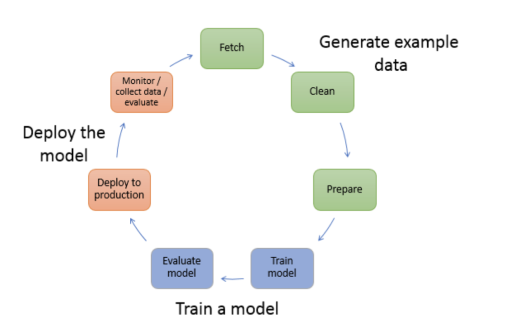

### Introduction

Artificial Intelligence(AI) is one of the fastest-growing areas in technology and Machine Learning is one of the most sought domains in AI. Currently, there are a lot of Machine Learning jobs available in the market but not enough Machine Learning Engineers. And no so surprisingly, Machine Learning jobs are one of the highest paying jobs in the market.

Luckily, Nowadays, Leading cloud service providers to give us services that ease the development of Machine learning tools. So, to start with Machine Learning you don’t need to know complex mathematical models and algorithms or experience of any high-level libraries and frameworks such as TensorFlow, PyTorch, Pandas, Scikit-learn, Scipy, Numpy, Keras, etc. However, as you make progress with machine learning skills and asked to build a more complex system, you would need to learn these libraries/frameworks.

In this tutorial, you won’t need to worry about these complex libraries and frameworks. Only basic Python programming knowledge and an [AWS](https://aws.amazon.com/) account is prerequisite for this tutorial.

**Whole tutorial will be posted in three parts.**

- [Part 1 - Basics of Machine Learning and AWS Sagemaker](/machine-learning-for-beginners-with-amazon-sagemaker/)
- [Part 2 - Hands on: Building and training a machine learning model for a real world problem](/machine-learning-for-beginners-with-amazon-sagemaker-part-2/)
- [Part 3 - Further improvements on previously build model and exposing to end user](/machine-learning-for-beginners-with-amazon-sagemaker-part-3/)

If you have basic knowledge of common terminologies used in Machine Learning world, you can skip the first part and directly jump to [2nd part](/machine-learning-for-beginners-with-amazon-sagemaker-part-2/).

So without a further ado and all the AI/ML bullshit, let’s start with the tutorial. but before that lets quickly revisit the common terminologies used in standard ML application development flow.

### Terminology

Machine Learning development usually consists of the below steps.

- Data collection / Preparation / Processing (Creating training, validation and testing set)
- Choosing the model/Algorithm
- Train the model with training and validation set
- Verify the trained model with the testing set.
- Deploy the model

Advance steps:

- Model Hyperparameters Tuning
- Model Versioning

#### Jupyter(IPython) Notebook

Jupyter Notebook is an open-source interactive web app that allows you to create and share web pages that contain live code, equations, visualizations, and text. It’s quite convenient for data scientists and AI/ML developers to explore and visualize data in the Jupyter Notebook.


As you can see in the above image, you can use Notebook to run a piece of code, plot charts or anything that you can do in standard Ipython shell.

Amazon SageMaker provides fully managed [Jupyter Notebook](https://jupyter.org/) instances that help in analyzing and processing the data easily.

More details can be found on [AWS SageMaker Notebook page](https://docs.aws.amazon.com/sagemaker/latest/dg/nbi.html)

#### 1\. Data Processing & Preparing

As we know the only goal of machine learning is to predict results by feeding the data. So preparing the data to train models and input data is really important.

In the first step, We work on a dataset that needs to be processed and converted in a format that can be fed to the Machine Learning model.

Datasets usually gathered by our application but there are other platforms available as well. for example, Apache provides a very good dataset for [legit and spam emails](https://spamassassin.apache.org/old/publiccorpus/), IMDB provides a large dataset for [movie reviews that tells us whether a movie is good or bad](http://ai.stanford.edu/~amaas/data/sentiment/). [Kaggle](https://www.kaggle.com/) is one of the best place to explore different datasets and solutions proposed by developers across the globe.

Once we have processed the data, we split it into three subsets Training, Validation and Testing set.

Training set is used to train the model, the validation set is used to validate the model and the testing set is used to test the trained model.

#### 2\. Choosing a Model

Another important and difficult step is to choose a proper algorithm/model for your problem. Multiple models can be used for a single problem and all of them could perform differently. So most of the time we play with different models to find the best suitable model for our problem.

Some of the popular ones are -

- Linear Regression
- Decision Tree
- Random Forest
- Logistic Regression
- Naive Bayes
- Neural Network (multi-layered model)

To get an idea of what model is best for your problem, you can refer to [Scikit-Learn Machine Learning Map](https://scikit-learn.org/stable/tutorial/machine_learning_map/index.html)

Amazon SageMaker provides several built-in machine learning algorithms that fit most of the solutions. Below is the example of using the XGBoost algorithm using SageMaker

```python
import sagemaker
from sagemaker.amazon.amazon_estimator import get_image_uri 

session = sagemaker.Session()

# Get the container for XGBoost
container = get_image_uri(session.boto_region_name, 'xgboost', repo_version='0.90-2')  # Get the URI for new container
xgb_estimator = sagemaker.estimator.Estimator(
    container, # The location of the container we wish to use
    role,                                    # What is our current IAM Role
    train_instance_count=1,                  # How many compute instances
    train_instance_type='ml.m4.xlarge',      # What kind of compute instances
    output_path='s3://{}/{}/output'.format(session.default_bucket(), prefix),
    sagemaker_session=session
)
```

If you want to use XGBoost as a framework, use it directly -

```python
import sagemaker.xgboost

xgb_estimator = XGBoost(
     entry_point='myscript.py', 
     source_dir,
     model_dir, 
     train_instance_type,                    
     train_instance_count, 
     hyperparameters, 
     role, 
     base_job_name, 
     framework_version='0.90-2', 
     py_version
)
```

#### 3\. Train the Model

In this step, we feed the chosen algorithm with the training dataset and then algorithm learns from it to predict the result for future input data.

Once we have the estimator object ready, we can feed the estimator with the training dataset and validation dataset to avoid overfitting. We provide the path to datasets to estimator object. Another benefit of using SageMaker is that we can conveniently provide the path of S3 files.

```python
xgb_estimator.fit({'train': training_data_set_path, 'validation': validation_data_set_path})
```

#### 3\. Test the Model

Once we trained the model, we test the model with the testing dataset and assert the returned result accuracy. To do this we will make use of SageMaker’s Batch Transform functionality. To start with, we need to build a transformer object from our trained(fit) model. We, then, ask SageMaker to begin a batch transform job using our trained model and applying it to the test data.

```python
xgb_transformer = xgb_estimator.transformer(instance_count=1, instance_type='ml.m4.xlarge')
xgb_transformer.transform(test_data_set_path, content_type='text/csv', split_type='Line')
```

It will be executed in the background. To see what is the job doing, we can use the `wait()` method. This will give us detailed output that we can use to trace the errors in case something goes wrong.

```python
xgb_transformer.wait()
```

We use this transformer object to find out the accuracy of the trained model with the test data that we provided to the transformer class. `xgb_transformer.output_path` is the path of predictions of the test dataset. we provide this prediction and the original/expected result to a function that sklearn provide (i.e `accuracy_score`)

```python
from sklearn.metrics import accuracy_score
accuracy_score(expected, actual_predicted, normalize=True)
```

This will give us the accuracy score between 0 to 1, Where 1 means the best performance/prediction.

#### 4\. Deploy the Model

Once we train and test the model, we need to deploy so that we can feed the trained model with real/live data and predict the result. With SageMaker, This can be done in one line.

```python
xgb_predictor = xgb_estimator.deploy(initial_instance_count=1, instance_type='ml.m4.xlarge')
```

#### 5\. Model Hyperparameters Tuning

If we further want to improve the accuracy of the trained model, we play with hyperparameters(AKA meta-parameters) and try to make them as optimized as we can to increase the accuracy. Every Model itself has a lot of parameters that are crucial and important. However, few extra parameters are not directly related to the model but can influence the training. such as no of iterations, batch size, etc.

```python
xgb_estimator.set_hyperparameters(
    max_depth=5, eta=0.2, gamma=4, min_child_weight=6, subsample=0.8, silent=0,
    objective='binary:logistic', early_stopping_rounds=10, num_round=500
)
```

Hyperparameters Tuning should be done before training the model. If we manipulate Hyperparameters after training, we need to train the model again.

```python
xgb_estimator.fit({'train': training_data_set_path, 'validation': validation_data_set_path})
 
# And then deploy again
 
xgb_predictor = xgb_estimator.deploy(initial_instance_count=1, instance_type='ml.m4.xlarge')
```

##### In summary, all the above steps can be visualized in the below image starting from fetching the data -



_image source: aws.amazon.com_

In the next(2nd) part, We’ll implement a full end-to-end solution using apache’s dataset to detect whether an email is spam or not. We’ll also be exploring different models/algorithms and compare their performance in the most easiest way possible.

### EDIT: [Part-2 is here](/machine-learning-for-beginners-with-amazon-sagemaker-part-2/)!
