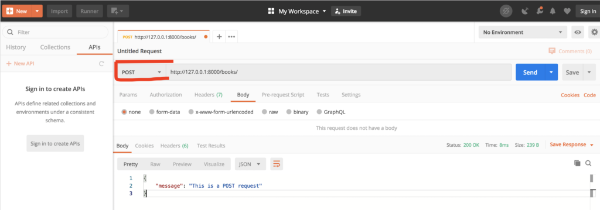
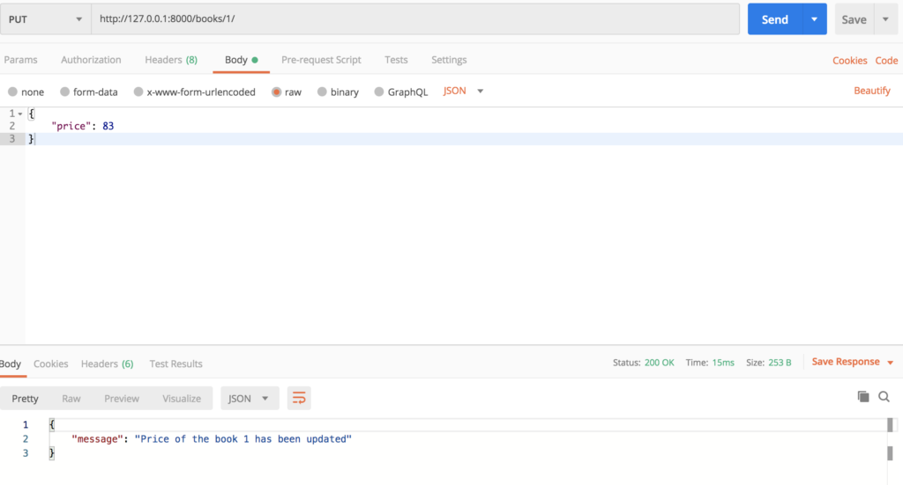

In this tutorial, we are going to build a few JSON based CRUD(Create, Read, Update, Delete) APIs in Django without using any additional library such as Django Rest Framework (DRF) or Tastypie.

## Install & Setup

**1\. Install Django**

_This tutorial is based on Python3.7 and Django 3.0. So please make sure you have Python3.7 or later and Django 3.0 or later installed in your system_.

Install pip [from here](https://pip.pypa.io/en/stable/installing/) if you haven't already, skip otherwise. Once pip installed, you can install Django using pip. (you might need to run the command with sudo if you are not using virtualenv)

```
gaurav@gaurav$ pip install django==3.0
```

You can also _[Follow the detailed installation instructions here](https://docs.djangoproject.com/en/dev/topics/install/)_ if you face any issue.

**2\. Create and setup the project**

First, we need to set up the project. For that, you can simply follow the below instructions to get everything ready.

```bash
gaurav@gaurav$ django-admin startproject pygj
gaurav@gaurav$ cd pygj
gaurav@gaurav$ python manage.py startapp myapp
gaurav@gaurav$ python manage.py migrate
```

```bash
  Apply all migrations: admin, auth, contenttypes, sessions
Running migrations:
  Applying contenttypes.0001_initial... OK
  Applying auth.0001_initial... OK
  Applying admin.0001_initial... OK
  Applying admin.0002_logentry_remove_auto_add... OK
  Applying admin.0003_logentry_add_action_flag_choices... OK
  Applying contenttypes.0002_remove_content_type_name... OK
  Applying auth.0002_alter_permission_name_max_length... OK
  Applying auth.0003_alter_user_email_max_length... OK
  Applying auth.0004_alter_user_username_opts... OK
  Applying auth.0005_alter_user_last_login_null... OK
  Applying auth.0006_require_contenttypes_0002... OK
  Applying auth.0007_alter_validators_add_error_messages... OK
  Applying auth.0008_alter_user_username_max_length... OK
  Applying auth.0009_alter_user_last_name_max_length... OK
  Applying auth.0010_alter_group_name_max_length... OK
  Applying auth.0011_update_proxy_permissions... OK
  Applying sessions.0001_initial... OK
```

```bash
gaurav@gaurav$ pygj python manage.py createsuperuser
Username (leave blank to use 'gaurav.jain'):
Email address:
Password:
Password (again):
This password is too short. It must contain at least 8 characters.
This password is too common.
This password is entirely numeric.
Bypass password validation and create user anyway? [y/N]: y
Superuser created successfully.
```

```bash
gaurav@gaurav$ python manage.py runserver
```

```bash
Watching for file changes with StatReloader
Performing system checks…

System check identified no issues (0 silenced).
June 12, 2020 - 06:51:26
Django version 3.0.6, using settings 'pygj.settings'
Starting development server at http://127.0.0.1:8000/
Quit the server with CONTROL-C.
```

Visit: [http://127.0.0.1:8000/admin/](http://127.0.0.1:8000/admin/) and login with the superuser credentials that you created above.


If you are able to see this page that means the initial setup is successfully completed. Now, we can jump straight on writing APIs.

Take a moment to understand couple of things we did here.

- Created a basic Django project structure using standard commands provided by Django
- Created Table in the database for existing migrations that comes with Django. This will create **user**, **auth**, **session**, **admin** and **contenttypes** table in the database. Note that we never provided the database information in the project. in that case, Django by default creates an SQLite database file in the project root directory with the name **db.sqlite3**. In a real-world application, you would be using MySQL, PostgreSQL or other production-grade SQL database. for the sake of this tutorial and to keep it simple, we'll use SQLite DB. If you want to change the database, you can do so by updating the **DATABASES** variable in **pygj/settings.py** file. [Read more about DB settings here](https://docs.djangoproject.com/en/dev/ref/settings/#databases).
- Then Created a superuser to access the Admin page to see the inserted data in the database. you can also use other SQL GUI clients to see the data.
- Finally started the local server on a default port 8000 and accessed admin page to verify the setup.

## 2\. Writing a simple API

Lets first write a simple API that gives us a hardcoded JSON response. Once we are familiar with that, we'll write API that actually gets the data from the DataBase. Further, we'll write API to update/delete the data in the database as well. Let's begin!

Go ahead and open the **mpapp/views.py** file and copy the below code.

```python
from django.http import JsonResponse

def my_api_view(request):
    data = {
        'name': request.user.username,  # username of current logged-in user, otherwise Anonymous
        'url': 'https://www.gauravvjn.com/',
        'skills': ['Python', 'Django'],
    }
    return JsonResponse(data)
```

We created a view(function) which accept the request parameter and return the response. Inside the view, we created a dictionary object that we want to return and passed this dictionary to JsonResponse class provided by Django.  
Next step is to create a URL/endpoint that we can use to access this view. To do that we create a new file called **urls.py** inside the **myapp** directory. Copy the below code in the file **myapp/urls.py**.

```python
from django.urls import path

from .views import my_api_view

urlpatterns = [
    path('awesome-api/', my_api_view),
]
```

We imported the view created in the first step. We also created a URL path and pointed to the view we just imported. Simply this means whenever someone visit **/awesome-api/** it will execute the **my\_api\_view** function. However, as you get an in-depth understanding of the Django you will find out that there are number of middlewares gets hit before the view when you hit the URL but we don't have to worry about that in this tutorial.

The last thing that we want to do that is to tell Django to register the URL we just created and for that we need to include the URL file that we just created above. Open the file pygj/urls.py and you will see there are already admin URLs imported. Remove all the lines and copy the below code.

```python
from django.contrib import admin
from django.urls import include, path

urlpatterns = [
    path('admin/', admin.site.urls),
    path('', include('myapp.urls'))
]
```

We added 1 line **path('', include('myapp.urls'))** in the urlpatterns list after the admin url.

Now visit the URL [http://127.0.0.1:8000/awesome\_api/](http://127.0.0.1:8000/awesome_api/) in your browser, you should be able to see the content similar to below.

```json
{
  "name": "gaurav.jain",
  "url": "https://www.gauravvjn.com/",
  "skills": [
    "Python",
    "Django"
  ]
}
```

If you are not logged in then you will see empty value in the name field. You can use curl to identify the request headers. open and new tab on the terminal and execute **curl -i http://127.0.0.1:8000/awesome\_api/**, you should be able to see similar content as below.

```bash
gaurav@gaurav$ curl -i http://127.0.0.1:8000/awesome_api/
HTTP/1.1 200 OK
Date: Fri, 12 Jun 2020 08:00:29 GMT
Server: WSGIServer/0.2 CPython/3.7.4
Content-Type: application/json
X-Frame-Options: DENY
Content-Length: 79
Vary: Cookie
X-Content-Type-Options: nosniff

{"name": "gaurav.jain", "url": "https://www.gauravvjn.com/", "skills": ["Python", "Django"]}
```

if you look closely you will see the value of **Content-Type** header which is **application/json**.

Congratulations! You just created your first JSON API using Django.

This is the simplest approach you can take to build an API using a function. This makes sense when you have APIs with minimal logic but in reality, APIs are much more complex and writing all the logic in the view function become cumbersome. To overcome, to a certain extent, we can use [Class based View](https://docs.djangoproject.com/en/dev/topics/class-based-views/intro/). For example, if we want to write the same API using Class based view, we can write -

```python
from django.views import View

class MyAPIView(View):
    def get(self, request):
        data = {
            'name': request.user.username,  # username of current logged-in user, otherwise Anonymous
            'url': 'https://www.gauravvjn.com/',
            'skills': ['Python', 'Django'],
        }

        return JsonResponse(data)
```

And in the **myapp/urls.py**, we'll use

```python
from django.urls import path

from .views import MyAPIView

urlpatterns = [
    path('awesome_api/', MyAPIView.as_view()),
]
```

You might be saying "_but this is more complicated than the one we created earlier"_. I agree, Surely it looks, but don't forget, that was just a dumb API which always returns the almost same response. In a real application using class based view can save you much more time and headache. A class based view has some advantages over a function-based view. We won't go into those details, you can see the pros/cons [here](https://stackoverflow.com/questions/14788181/class-based-views-vs-function-based-views).

Let's move ahead and build a dynamic API to get a more clear picture.

## 3\. Writing a dynamic API

Let's create a simple table for Book with three columns- title, author & price. In Django, this is done in 3 steps.  
1\. Create/Update models.  
2\. Create migration file for created/updated model in the above line  
3\. Apply the migration to reflect changes at the database level.

Let's go through each step one by one.  
1) Copy the below content in the **myapp/models.py**

```python
from django.db import models

class Book(models.Model):
    title = models.CharField(max_length=255)
    author = models.CharField(max_length=127)
    price = models.IntegerField()
```

In **pygj/settings.py** file, find the variable **INSTALLED\_APPS** and append **myapp** to the list as below. This is required for migration.

```python
# Application definition

INSTALLED_APPS = [
    'django.contrib.admin',
    'django.contrib.auth',
    'django.contrib.contenttypes',
    'django.contrib.sessions',
    'django.contrib.messages',
    'django.contrib.staticfiles',
    'myapp',
]
```

2) Create a migration file for newly created Book model.

```python
gaurav@gaurav$ python manage.py makemigrations myapp
```

This will create a file **myapp/migrations/0001\_initial.py** which Django use to create or update database.

3) Apply the migration

```python
gaurav@gaurav$ python manage.py migrate
```

4) This step is not necessary but to manage book data from the admin page, we need to register the Book model with the admin. Add below code in the **myapp/admin.py** file.

```python
from django.contrib import admin
from .models import Book

admin.site.register(Book)
```

Now, if start the server again using **python manage.py runserver** and visit the admin page [http://127.0.0.1:8000/admin/](http://127.0.0.1:8000/admin/). You should be able to see the Books section. If you click on this, you will find 0 books there, thats because we haven't created any book yet so let's do that first. Add a new book by clicking **ADD BOOK** button, Fill in the details and Save it.


Similarly, add another book from the Admin page. At this point we should have 2 book objects in the database, we can verify this by visiting [http://127.0.0.1:8000/admin/myapp/book/](http://127.0.0.1:8000/admin/myapp/book/) page.

Time to write an API which returns all the book from the database.

## GET API

Add below code in the **myapp/views.py** file just below the code you have written previously.

```python
from .models import Book

class BookView(View):
    def get(self, request):
        books_count = Book.objects.count()  # TOTAL books in the database
        books = Book.objects.all()  # Get all book objects from the database

        data = {
            'books': books,
            'count': books_count,
        }
        return JsonResponse(data)
```

And as you remember, earlier in this tutorial, we created a URL path to attach with a view. We are going to do the same with the new view **BookView**. Open the **myapp/urls.py** file and replace the previous code with below code.

```python
from django.urls import path

from .views import MyAPIView, BookView  # Note the import of `BookView` view

urlpatterns = [
    path('awesome_api/', MyAPIView.as_view()),
    path('books/', BookView.as_view()),
]
```

If you call the API [http://127.0.0.1:8000/books/](http://127.0.0.1:8000/books/), you will get an Error saying _Object of type QuerySet is not JSON serializable_. That's because we are trying to send the book objects directly without serializing them. There are many ways to serialize Django object or a queryset. Some of them are -

1. Manually serialize the object fields individually and prepare the response data.
2. Use inbuilt serializer to serialize the object.
3. Use third-party libraries such as [DjangoRestFramework](https://www.django-rest-framework.org/).

Since we want to do everything in Pure Django, we'll not talk about the 3rd option.

1. **Manually Serialize the object.**

```python
class BookView(View):
    def get(self, request):
        books_count = Book.objects.count()  # TOTAL books in the database
        books = Book.objects.all()  # Get all book objects from the database

        books_serialized_data = []  # to store serialized data
        for book in books:
            books_serialized_data.append({
                'book_title': book.title,
                'author_name': book.author,
                'book_price': book.price,
            })

        data = {
            'books': books_serialized_data,
            'count': books_count,
        }
        return JsonResponse(data)
```

Add this code to your view and visit the URL ([http://127.0.0.1:8000/books/](http://127.0.0.1:8000/books/)) again, you should be able to see the below response.

```json
{
    "books": [
        {
            "book_title": "Book title 1",
            "author_name": "Book author",
            "book_price": 100
        },
        {
            "book_title": "Book title 2",
            "author_name": "Book author 2",
            "book_price": 120
        }
    ],
    "count": 2
}
```

This can be tedious if you have large tables and your views can get messy. You can also use **value\_list** method on the queryset to get rid of manually serializing data but that may not be sufficient for the applications which have complex relations between tables.

**2\. Using inbuilt serializer**

```python
from django.core.serializers import serialize  # import serializer from django 

class BookView(View):
    def get(self, request):
        books_count = Book.objects.count()  # TOTAL books in the database
        books = Book.objects.all()  # Get all book objects from the database

        # Provide the serialize type such as python, json, xml, yaml, etc.
        # Here we are using 'python' because JsonResponse will automatically convert it to 'json'
        books_serialized_data = serialize('python', books)

        data = {
            'books': books_serialized_data,
            'count': books_count,
        }
        return JsonResponse(data)
```

And that's it! Visit the API([http://127.0.0.1:8000/books/](http://127.0.0.1:8000/books/)) again.

```json
{
    "books": [
        {
            "model": "myapp.book",
            "pk": 1,
            "fields": {
                "title": "Book title 1",
                "author": "Book author",
                "price": 100
            }
        },
        {
            "model": "myapp.book",
            "pk": 2,
            "fields": {
                "title": "Book title 2",
                "author": "Book author 2",
                "price": 120
            }
        }
    ],
    "count": 2
}
```

But the problem is it comes with extra fields that we might not want to expose to users. You can definitely customize the serialized data by removing those fields. I encourage you to play with this and customize the data as per your wish. This can be a good exercise for you to get familiar with Django.  
You can read more about this [here](https://docs.djangoproject.com/en/3.0/topics/serialization/) and [here.](https://stackoverflow.com/questions/9403120/getting-django-to-serialize-objects-without-the-fields-field)

Great! At this point we have our GET api ready which returns all the book data.

_Note that in a production application you have to take care of [pagination](https://docs.djangoproject.com/en/dev/topics/pagination/), [authentication](https://docs.djangoproject.com/en/dev/topics/auth/default/#authentication-in-web-requests), [](https://docs.djangoproject.com/en/3.0/topics/pagination/)[permissions-and-authorization](https://docs.djangoproject.com/en/dev/topics/auth/default/#permissions-and-authorization), etc. This tutorial is for an absolute beginner, so you don't need to worry about these._

To continue with the tutorial, we need to install an API client such as [Postman](https://www.postman.com/downloads/). This makes our life easier while developing APIs. After installation, try to execute the **[get all books](http://127.0.0.1:8000/books/)** API we created earlier.


You can see the response we observed previously. For **GET** APIs it doesn't make much difference but for POST, PUT, DELETE APIs it's quite convenient to use Postman. We are going to build these APIs and will be using Postman for debugging and testing purpose.

_If you are not familiar with these HTTP verbs, I strongly advise you to read about these [here](https://www.w3schools.com/tags/ref_httpmethods.asp) or [here](https://www.restapitutorial.com/lessons/httpmethods.html)_

Alright, let's begin with POST API.

Currently, our view just supports the GET method. To support the POST method, we have to add another method called post in this View. We also have to apply CSRF exempt decorator on the class. This is not recommended on a production application. I have explained about CSRF in [this post](/security-in-the-django-application/#csrf). Copy the below code in your class. I have removed the lines from **get** method to keep this class short but you can simply copy other changes.

## POST API

```
from django.utils.decorators import method_decorator
from django.views.decorators.csrf import csrf_exempt

@method_decorator(csrf_exempt, name='dispatch')
class BookView(View):
    def get(self, request):
        ...

    def post(self, request):
        data = {'message': 'This is a POST request'}
        return JsonResponse(data)
```

This time no need to change in the **urls.py** file. Open Postman and hit the API using the POST type as shown in the below image.



Great! This means the setup works. Now we can modify the post method to accept book data from the user and create book objects.

```python
import json

@method_decorator(csrf_exempt, name='dispatch')
class BookView(View):

    ...

    def post(self, request):
        post_body = json.loads(request.body)   # don't forget to import json

        book_title = post_body.get('title')
        book_author = post_body.get('author')
        price = post_body.get('price')

        book_data = {
            'title': book_title,
            'author': book_author,
            'price': price,
        }

        book_obj = Book.objects.create(**book_data)
        data = {
            'message': f'New book object has been created with id {book_obj.id}'
        }
        return JsonResponse(data, status=201)
```

This view accepts 3 fields in the JSON body, those are- title, author and price and then save into database using **Book.objects.create**. Go ahead and hit the API using Postman.

Select **raw** option in **body** tab on Postman. and from the dropdown select **JSON** (right to GraphQL).


Now you can verify this by opening admin page [http://127.0.0.1:8000/admin/myapp/book/](http://127.0.0.1:8000/admin/myapp/book/). you should be able to see the newly created book object.

This is a naive implementation. ideally, you should be handling all the fields and return the response accordingly.  
for e.g if the user doesn't provide any of these 3 fields, you should return [400](https://en.wikipedia.org/wiki/List_of_HTTP_status_codes#400) [BAD REQUEST](https://en.wikipedia.org/wiki/List_of_HTTP_status_codes#400) with the appropriate message. Also, if you see the above image carefully, you'll see the status is [201 Created](https://en.wikipedia.org/wiki/List_of_HTTP_status_codes#201) because we passed that explicitly in the **JsonResponse**, Default is [200 OK](https://en.wikipedia.org/wiki/List_of_HTTP_status_codes#200).

## PUT API

Imagine a scenario when you have to update the price of a book that already exists in your database. How would you do that? Commonly, PUT APIs are used in such a scenario where you have to update existing data. Let's implement PUT API and try to update a price for a book.

We need to create a new view as well as a new URL pattern. Unlike GET or POST we simply used **/books/**. But now we are going to work on an existing data, so we need to provide a unique identifier in the request to identify those objects and Update or delete them accordingly. In our example, a unique identifier would be **[id](https://docs.djangoproject.com/en/dev/topics/db/models/#automatic-primary-key-fields)**.  
Copy the below code in **myapp/views.py**.

```python
@method_decorator(csrf_exempt, name='dispatch')
class BookUpdateDeleteView(View):

    def put(self, request, book_id):  # extras url parameter book_id is manadaotry
        book = Book.objects.get(id=book_id)

        put_body = json.loads(request.body)
        book.price = put_body.get('price')
        book.save()

        data = {
            'message': f'Price of the book {book_id} has been updated'
        }
        return JsonResponse(data)
```

and in the **myapp/urls.py**, add a path for this view. After adding this, you should have 3 path objects in the urlpatterns list. Don't forget to import **BookUpdateDeleteView**.

```python
from .views import MyAPIView, BookView, BookUpdateDeleteView  

urlpatterns = [
    path('awesome_api/', MyAPIView.as_view()),
    path('books/', BookView.as_view()),
    path('books/<int:book_id>/', BookUpdateDeleteView.as_view()),
]
```

Let's understand what is happening here. We create a new view class **BookUpdateDeleteView** and created a method called **put** inside the class. An important thing to note here is, **put** method is expecting one more parameter which is **book\_id**. This parameter should exactly be the same as we specified in the path  
e.g. **path('books/<int:book\_id>/', BookUpdateDeleteView.as\_view())**. This path translate to  
**/books/1/**, **/books/37/**, etc. Alright, Let's try it out in the Postman. We want to change the price of the first book which is currently 100. New price should be, let' say, 83. Select the PUT method type as we did for POST, use the URL **http://127.0.0.1:8000/books/2/** and then provide the price in JSON body.



If you open admin page [http://127.0.0.1:8000/admin/myapp/book/1/change/](http://127.0.0.1:8000/admin/myapp/book/1/change/), you should be able to see the new price.

## DELETE API

Delete API is similar to PUT API. We create a method called **delete** in the view class. This method expects two parameters(**request** and **book\_id)** similar to the **put** method. We simply get the book object from the database based on the provided book\_id in the URL. and delete the object.

```python
@method_decorator(csrf_exempt, name='dispatch')
class BookUpdateDeleteView(View):

    def put(self, request, book_id):
        ...

    def delete(self, request, book_id):
        book = Book.objects.get(id=book_id) # get the object from DB
        book.delete()  # delete the entry
        # you can also combine these 2 statements: Book.objects.get(id=book_id).delete()

        data = {
            'message': f'Book object with id {book_id} has been deleted'
        }
        return JsonResponse(data)
```

Let's delete the 2nd book object from the database Open the Postman, select DELETE method from the dropdown, use URL **http://127.0.0.1:8000/books/2/**, hit Send button.


Visit the GET API [http://127.0.0.1:8000/books/](http://127.0.0.1:8000/books/) again, and you should not be able to see the deleted entry. You can also visit the [admin page](http://127.0.0.1:8000/admin/myapp/book/) to see available entries.

## Conclusion

In a sizable application, it makes more sense to use DRF. It eases the task of serializing or deserializing the data, abstract out a lot of boilerplate code for APIs and developing APIs is just a matter of minutes. However, You are now equipped with all basic knowledge required for API building and ready to take on the world. 😎  
You can find the code for views and URLs [here](https://gist.github.com/gauravvjn/70419bcdad6950565ad71dd2839d12c1).
